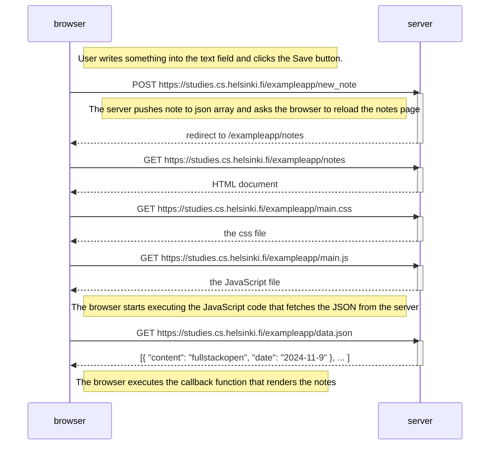

```mermaid
sequenceDiagram
    participant browser
    participant server

    Note right of browser: User writes something into the text field and clicks the Save button. 

    browser ->> server: POST https://studies.cs.helsinki.fi/exampleapp/new_note
    activate server
    Note left of server: The server pushes note to json array and asks the browser to reload the notes page
    server -->> browser: redirect to /exampleapp/notes
    deactivate server

    browser->>server: GET https://studies.cs.helsinki.fi/exampleapp/notes
    activate server
    server-->>browser: HTML document
    deactivate server

    browser->>server: GET https://studies.cs.helsinki.fi/exampleapp/main.css
    activate server
    server-->>browser: the css file
    deactivate server

    browser->>server: GET https://studies.cs.helsinki.fi/exampleapp/main.js
    activate server
    server-->>browser: the JavaScript file
    deactivate server

    
    Note right of browser: The browser starts executing the JavaScript code that fetches the JSON from the server

    browser->>server: GET https://studies.cs.helsinki.fi/exampleapp/data.json
    activate server
    server-->>browser: [{ "content": "fullstackopen", "date": "2024-11-9" }, ... ]
    deactivate server

    Note right of browser: The browser executes the callback function that renders the notes
```
    

    