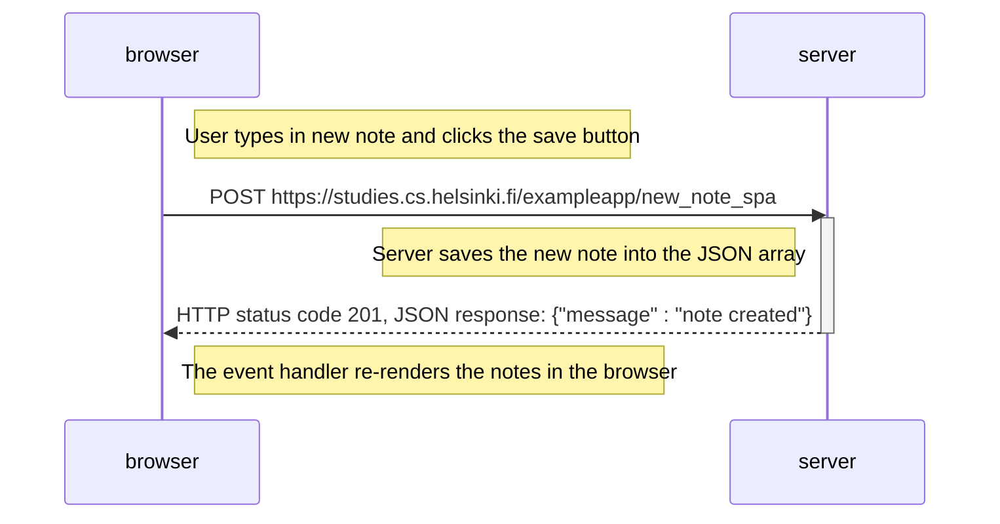

```mermaid

sequenceDiagram
    participant browser
    participant server

    Note right of browser: User types in new note and clicks the save button 

    browser->>server: POST https://studies.cs.helsinki.fi/exampleapp/new_note_spa
    activate server
    Note left of server: Server saves the new note into the JSON array
    server-->>browser: HTTP status code 201, JSON response: {"message" : "note created"}
    deactivate server

    Note right of browser: The event handler re-renders the notes in the browser
```
    

    